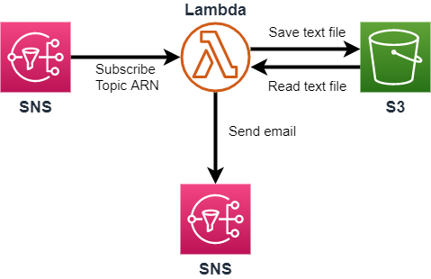

# aws-iprange-change-notifier

AWS에서 서비스에 사용하고 있는 Public IP들의 대역은 공식적으로 AWS에서 [IP 대역 JSON형식](https://ip-ranges.amazonaws.com/ip-ranges.json)으로 제공해주고 있습니다.  

참고 : https://ip-ranges.amazonaws.com/ip-ranges.json

많은 사용들이 이러한 IP 대역을 주기적으로 확인하여 방화벽 규칙을 관리하는데 사용하고 있기는 합니다.\
그러나 IP 대역의 변경이 주기적으로 발생하지는 않아, 변경이 발생되었을때 이를 신속히 인지하고 적절한 대응이 필요하게 됩니다.

이 리포지토리는 이를 이용하여 IP 대역의 변경이 발생되었을때, lambda를 활용하여 변경된 내용에 대해서 지정된 메일주소로 안내를 해주게 됩니다.

## AWS 사용 서비스
* IAM : 람다 실행에 대한 접근 권한 통제
* Lambda : IP 변경에 대해 검증하고 필터링
* SNS : IP 변경에 대해 구독하고 lambda와 연결하고 결과를 보낼 이메일 등록
* S3 : IP 변경에 대한 정보를 저장



## IAM Policy & Role
lambda에서 실행시 참조하게된 policy 정책은 [code](./src/s3-sns-policy.json)를 참고

## Lambda
Basic Settings
* Runtime : python 3.6
* Memory : 128 MB
* Timeout : 3 sec

Environment Variables
|Key|Value|comment|
|-|-|-|
|bucket|*[bucket name]*|기존 IP정보와 결과를 저장하게될 s3 저장소 이름|
|key|*[object key]*|IP정보를 저장할 S3 오브젝트 키|
|region|*[region name]*|ip-ranges.json내 region|
|service|*[service name]*|ip-ranges.json내 service|
|snsarn|*[email sns arn]*|결과를 email로 전송하기 위한 SNS ARN|
\
예제는 cloudfront ip변경만 추적하는 예제이고, cloudfront는 Global서비스이니 region도 GLOBAL로 설정하면 되나, S3같은 경우 region도 희망하는 지역으로 환경변수를 설정하면 된다.

### ip-ranges.json 구문
```json
{
  "syncToken": "0123456789",
  "createDate": "yyyy-mm-dd-hh-mm-ss",
  "prefixes": [
    {
      "ip_prefix": "cidr",
      "region": "region",
      "network_border_group": "network_border_group",
      "service": "subset"
    }
  ],
  "ipv6_prefixes": [
    {
      "ipv6_prefix": "cidr",
      "region": "region",
      "network_border_group": "network_border_group",
      "service": "subset"
    }
  ]  
}
```

## SNS
AWS에서는 앞서 언급 했던것처럼 JSON형식으로 IP 대역을 제공해 주고 있으나, SNS에서 Topic으로 수신할수 있게도 ARN을 제공해 주고 있다.  

`arn:aws:sns:us-east-1:806199016981:AmazonIpSpaceChanged`  

> **NOTE:** \
> SNS에서 위 Topic ARN을 활용하여 구성할시 동일한 미국 동부(N.Virginia) 리전에서 구독을 생성해야 합니다. (Lambda 위치는 상관없음)

Reference URL : 
1. https://docs.aws.amazon.com/ko_kr/general/latest/gr/aws-ip-ranges.html#subscribe-notifications
2. https://aws.amazon.com/blogs/aws/subscribe-to-aws-public-ip-address-changes-via-amazon-sns/

## S3
lambda에서 사용한 임시파일과 최종 결과 파일을 저장하는 용도로 사용한다.
